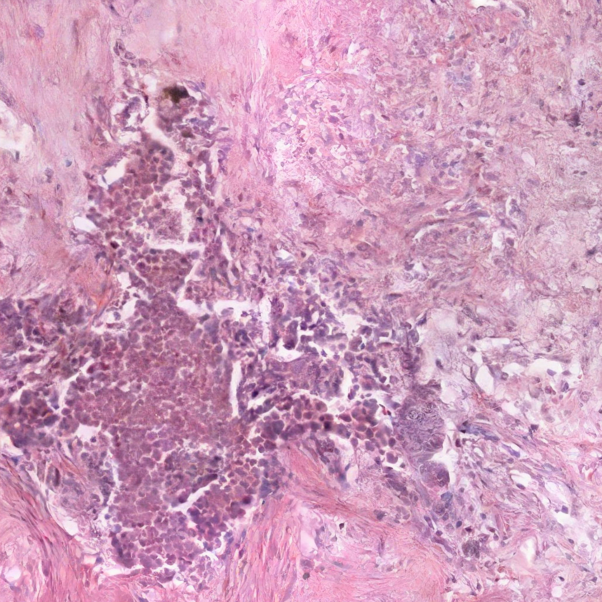
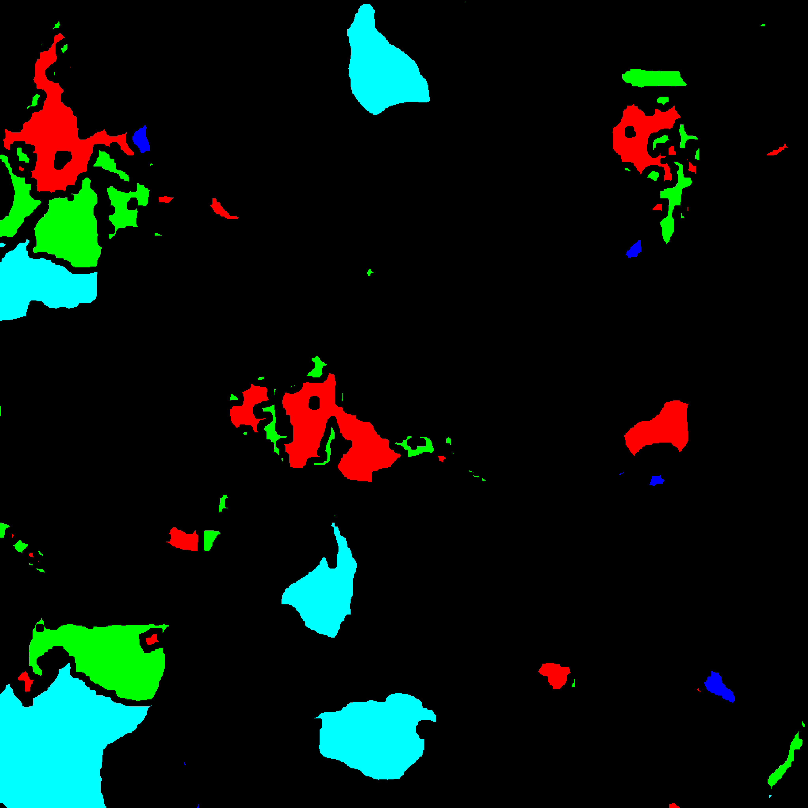
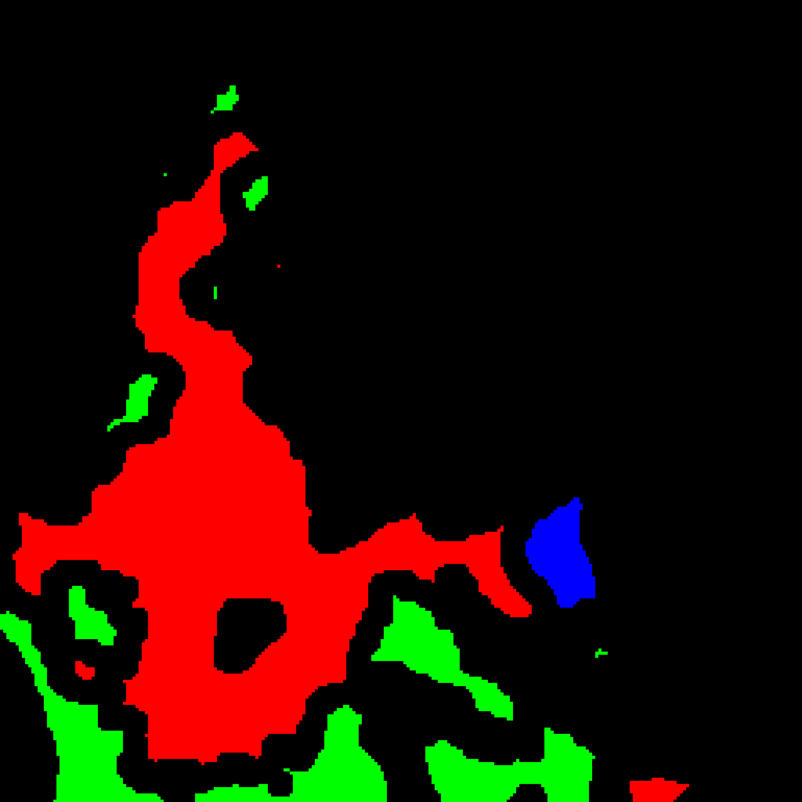
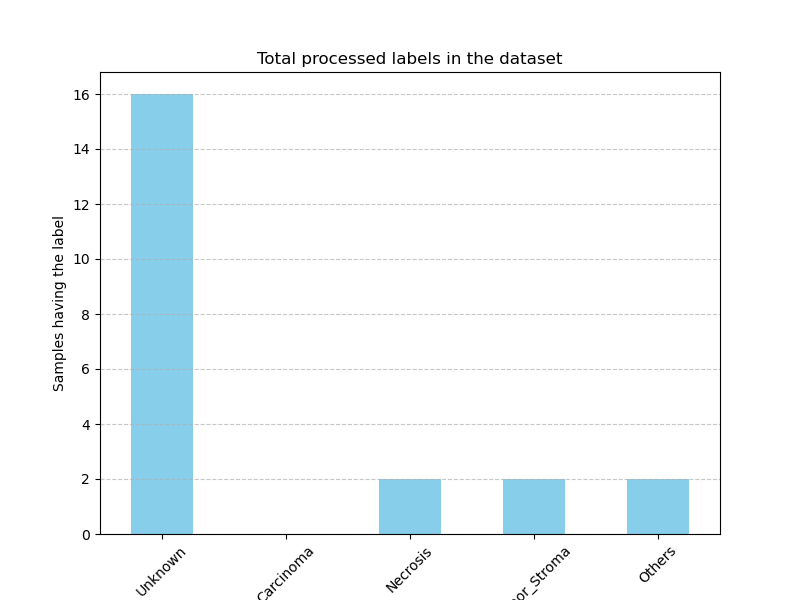
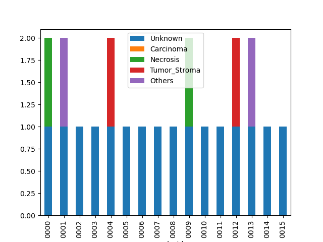

# WSI Preprocessing, Annotation and Patching


## Synthetic dataset pipeline

### Initial setup

Let's assume that we start from a synthetic parent dataset made up of WSI `4096x4096` with their respective masks with values going from 0 to (n_classes - 1), recall the [diffinfinite](https://arxiv.org/abs/2306.13384) paper which reports that we can choose a generation on 5 classes or on 10 classes


> example starting synth wsi (ω=3, 4096x4096)


### Dataset pre-split extraction

To obtain a dataset with wsi of comparable size to other datasets present in the literature such as Camelyon16, we do not compute yet the labels of the masks but rather perform a first split (defined as pre-split) of each wsi and its mask.

The pre-split 'denominator' can be configured through the `split.factor` parameter in the `config.yml` file, therefore with a `factor=4` on the starting size previously assumed we will therefore obtain from each parent wsi and parent mask as many as 16 wsi with their respective masks all of size `1024x1024`

You can enable pre-split by turning `split.enabled` to `True`

> Remember: labels will be computed at this mask resolution level

> example pre-split synth wsi (ω=3, 1024x1024, coords=(0,0), 1/16 of the above parent wsi)



#### Advantages

This approach allows for more time-efficient and robust generation on the algorithmic and operator side, avoiding generating dozens of smaller wsi but instead augmenting the dataset in post.
It is therefore possible to increase the size of the parent wsi as long as the system's VRAM allows it

### Whole Masks and Sub Masks color mapping

For better data understanding is possible to enable the `cmap_whole_masks`and/or the `gen_color_mapped_submasks` parameters in `config.yml`

In this way we can bring a mask (visually all black but in reality contains values very close to black from 0 to 4) into more recognizable color codes

> whole mask color mapping:




<br>
<br>

> sub mask color mapping 
> 1/16 of the above whole mask, coordinates (0,0):




#### Color Codes

    Unknown: rgb(0, 0, 0)   
    Carcinoma: rgb(0, 0, 255)
    Necrosis: rgb(255, 0, 0)
    Tumor Stroma: rgb(0, 255, 0)
    Others: rgb(0, 255, 255)

### Patching

Now we come to the actual patching, if we had enabled the pre-split we will patch from the output path of the pre-split otherwise the WSI parent images path defined in the config file

Therefore, assuming we now have 16 wsi at 1024x1024 we can adjust the patch size in the config file by tuning `out_patch_size`, we will now assume it to be `256` thus obtaining 16 patches for each wsi

> Note: masks too get patched, this can be useful to experiment (since we can compute the patch-level labels)

These will be stored in the following fashion:

```
diffinfinite_out/
│
∟ ─ patched_presplit_out/
    │
    ∟ ─ masks/
        │
        ∟ ─ {sample_id}/
            │
            ∟ ─ {sample_id}_x_{x_coord}_y_{y_coord}.jpg            
        patches/
        │
        ∟ ─{sample_id}/
            │
            ∟ ─ {sample_id}_x_{x_coord}_y_{y_coord}.jpg
````


### Annotator

We now define the annotation part, this takes care of:
- obtaining and saving the absolute classes of each mask
- defines strategies (you can easily add new ones in `strategy.py`)
- processes them based on the active strategy in the config file (in `annotator.strategy`)
- calculates the percentage of each class on the total (very useful value for reasons that we will introduce shortly)
- saves everything in a DataLoader-friendly csv file

We've already introduced a couple of trivial strategies for annotating masks: TopKLabeling and TopKThrLabeling with their parameters configurable too

The output csv file will look like this (real sample):


|sample_id|Unknown|Carcinoma|Necrosis|Tumor_Stroma|Others|ABS_Unknown|ABS_Carcinoma|ABS_Necrosis|ABS_Tumor_Stroma|ABS_Others|PERC_Unknown      |PERC_Carcinoma      |PERC_Necrosis        |PERC_Tumor_Stroma   |PERC_Others         |strategy_signature       |
|---------|-------|---------|--------|------------|------|-----------|-------------|------------|----------------|----------|------------------|--------------------|---------------------|--------------------|--------------------|-------------------------|
|0000     |1      |0        |1       |0           |0     |1          |1            |1           |1               |0         |0.8053102493286133|0.007275581359863281|0.13818359375        |0.04923057556152344 |0.0                 |TopKThrLabeling_k2_thr0.1|
|0001     |1      |0        |0       |0           |1     |1          |0            |1           |0               |1         |0.8941097259521484|0.0                 |0.00035858154296875  |0.0                 |0.10553169250488281 |TopKThrLabeling_k2_thr0.1|
|0002     |1      |0        |0       |0           |0     |1          |0            |0           |1               |1         |0.978510856628418 |0.0                 |0.0                  |1.52587890625e-05   |0.02147388458251953 |TopKThrLabeling_k2_thr0.1|
|0003     |1      |0        |0       |0           |0     |1          |0            |1           |1               |0         |0.8931102752685547|0.0                 |0.06301212310791016  |0.043877601623535156|0.0                 |TopKThrLabeling_k2_thr0.1|
|0004     |1      |0        |0       |1           |0     |1          |0            |1           |1               |1         |0.7715072631835938|0.0                 |0.000125885009765625 |0.11653995513916016 |0.11182689666748047 |TopKThrLabeling_k2_thr0.1|
|0005     |1      |0        |0       |0           |0     |1          |0            |1           |1               |0         |0.9569787979125977|0.0                 |0.03603649139404297  |0.006984710693359375|0.0                 |TopKThrLabeling_k2_thr0.1|
|0006     |1      |0        |0       |0           |0     |1          |0            |0           |0               |0         |1.0               |0.0                 |0.0                  |0.0                 |0.0                 |TopKThrLabeling_k2_thr0.1|
|0007     |1      |0        |0       |0           |0     |1          |1            |1           |1               |0         |0.9847116470336914|0.00388336181640625 |0.0025119781494140625|0.008893013000488281|0.0                 |TopKThrLabeling_k2_thr0.1|
|0008     |1      |0        |0       |0           |0     |1          |0            |1           |1               |0         |0.9820270538330078|0.0                 |0.012581825256347656 |0.005391120910644531|0.0                 |TopKThrLabeling_k2_thr0.1|
|0009     |1      |0        |1       |0           |0     |1          |0            |1           |1               |1         |0.7839956283569336|0.0                 |0.12654781341552734  |0.01989459991455078 |0.06956195831298828 |TopKThrLabeling_k2_thr0.1|
|0010     |1      |0        |0       |0           |0     |1          |0            |1           |1               |0         |0.991607666015625 |0.0                 |0.0007476806640625   |0.0076446533203125  |0.0                 |TopKThrLabeling_k2_thr0.1|
|0011     |1      |0        |0       |0           |0     |1          |1            |1           |0               |0         |0.9488687515258789|0.002685546875      |0.048445701599121094 |0.0                 |0.0                 |TopKThrLabeling_k2_thr0.1|
|0012     |1      |0        |0       |1           |0     |1          |1            |1           |1               |1         |0.5030860900878906|0.0001983642578125  |0.005748748779296875 |0.15685176849365234 |0.33411502838134766 |TopKThrLabeling_k2_thr0.1|
|0013     |1      |0        |0       |0           |1     |1          |0            |0           |0               |1         |0.8333845138549805|0.0                 |0.0                  |0.0                 |0.16661548614501953 |TopKThrLabeling_k2_thr0.1|
|0014     |1      |0        |0       |0           |0     |1          |0            |1           |1               |1         |0.9549198150634766|0.0                 |0.012845039367675781 |0.0003204345703125  |0.031914710998535156|TopKThrLabeling_k2_thr0.1|
|0015     |1      |0        |0       |0           |0     |1          |1            |1           |1               |1         |0.9766769409179688|0.011180877685546875|0.0009765625         |0.011074066162109375|9.1552734375e-05    |TopKThrLabeling_k2_thr0.1|

### Balancer

The balancer as of today simply asserts no class has 0 samples, if this happens the balancer will halt and lists all of the affected classes

To further facilitate this task, some graphs are constructed and saved in the `plots/` folder, such as the class graph across samples and the label graph across samples


<br>
<br>



## Non-Synth Scans Patching

Taking advantage of the old CLAM solution, which involved slow patching, we are going to extract the patches with coordinates from the original TIFF files

To achieve this we will calculate the HDF5 binary and extract from here all the patches along their coordinates

Is also possible to choose among standard prewhitening or imagenet normalization

# Credits

The synthetic dataset has been obtained through [diffinfinite](https://arxiv.org/abs/2306.13384) DM

The non-synthetic patching work is based on [CLAM](https://github.com/mahmoodlab/CLAM) slow patching algorithm